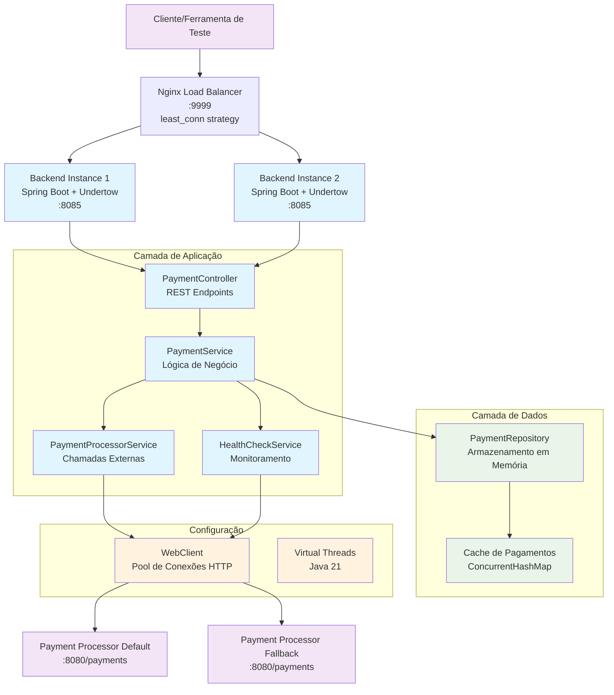
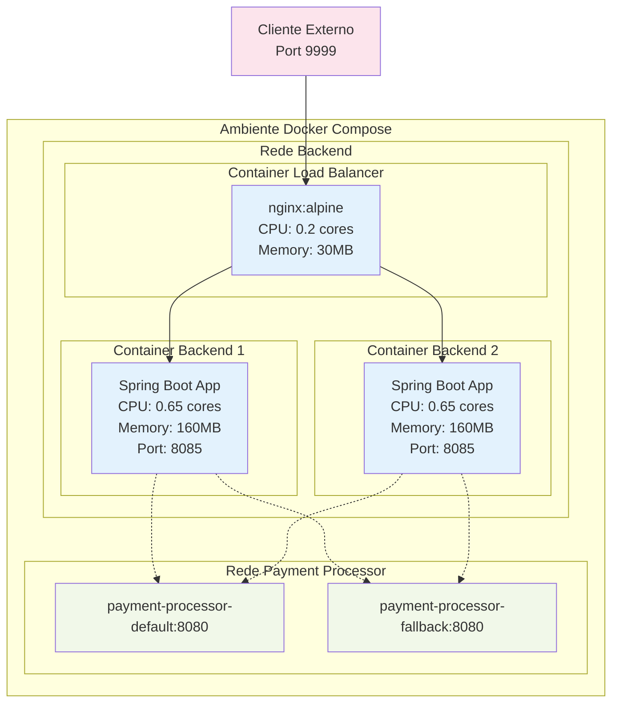
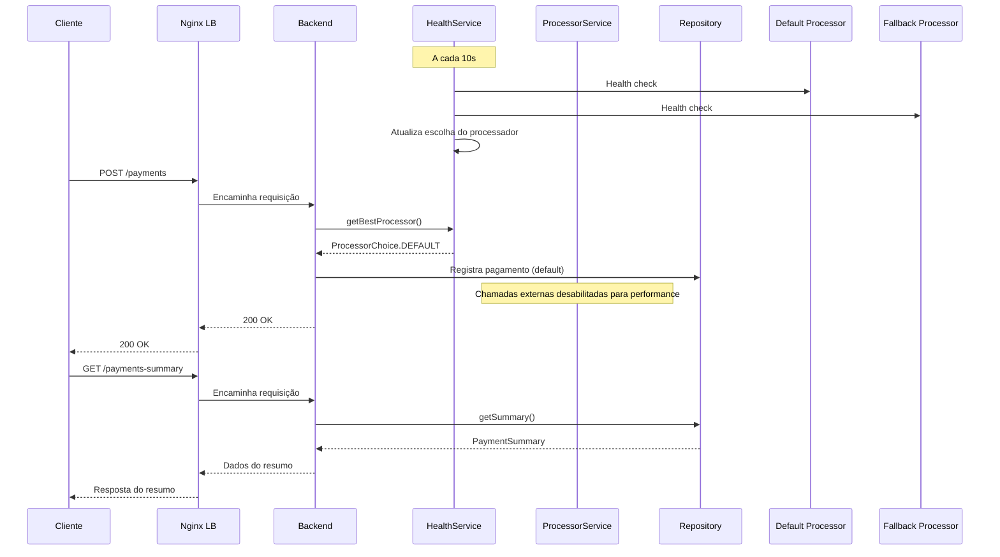

# 🐓 Rinha de Backend - Nerfa mais a JVM  ☕ 

<details align="left">

<div>

 <h1>  
 Signatures:
 </h1>

                   ⢀⣴⣿⣿⣿⣿⣿⣶⣶⣶⣿⣿⣶⣶⣶⣶⣶⣿⡿⣿⣾⣷⣶⣶⣾⣿⠀                                                                                                                          
                 ⣠⣿⣿⢿⣿⣯⠀⢹⣿⣿⣿⣿⣿⣿⣿⣿⣿⣿⣿⡇⣿⡇⣿⣿⣿⣿⣿⡇                                                                                                         
             ⠀⣰⣿⣿⣷⡟⠤⠟⠁⣼⣿⣿⣿⣿⣿⣿⣿⣿⣿⣿⣿⣿⢸⡇⣿⣿⣿⣿⣿⡇ 
             ⠀⣿⣿⣿⣿⣿⣷⣶⣿⣿⡟⠁⣮⡻⣿⣿⣿⣿⣿⣿⣿⣿⢸⡇⣿⣿⣿⣿⣿⡇ 
             ⠘⣿⣿⣿⣿⣿⣿⣿⣿⠏⠀⠀⣿⣿⣹⣿⣿⣿⣿⣿⣿⡿⢸⡇⣿⣿⣿⣿⣿⡇ 
             ⠀⠙⢿⣿⣿⣿⡿⠟⠁⣿⣿⣶⣿⠟⢻⣿⣿⣿⣿⣿⣿⡇⣼⡇⣿⣿⣿⣿⣿⠇
             ⠀⠀⠈⠋⠉⠁⣶⣶⣶⣿⣿⣿⣿⢀⣿⣿⣿⣿⣿⣿⣿⣇⣿⢰⣿⣿⣿⣿⣿⠀ 
             ⠀⠀⠀⠀⠀⠙⠿⣿⣿⣿⡄⢀⣠⣾⣿⣿⣿⣿⣿⣿⣿⣽⣿⣼⣿⣿⣿⣿⠇⠀ 
             ⠀⠀⠀⠀⠀⠀⠀⠈⠉⠒⠚⠿⠿⠿⠿⠿⠿⠿⠿⠿⠿⠛⠿⠿⠿⠿⠿⠋⠀⠀ 
             ⠀⠀⠀⠀⠀⠀⠀⠀⠀⠀⠀⠀⠀⠀⠀⠀⠀⠀⠀⠀⠀⠀⠀⠀⠀⠀⠀⠀⠀⠀ 
             ⠀⠀⠀⣿⣙⡆⠀⠀⡇⠀⢸⠀⠀⢸⠀⠀ ⢸⡇⠀⠀⢸⣏⡉  ⠙⡏⠁⠀ 
             ⠀⠀⠀⣿⣉⡷⠀⠀⢧⣀⣼ ⠀⢸⣀  ⢸⣇⡀ ⢸⣏⣁⠀ ⠀⡇⠀ 


  </div>

</details>


## 🏗️ Arquitetura do Sistema

### Visão Geral da Arquitetura



### Arquitetura de Deploy



### Fluxo de Dados



### Componentes Principais

| Componente | Responsabilidade | Tecnologia |
|------------|------------------|------------|
| **Nginx Load Balancer** | Balanceamento de carga entre instâncias | Nginx Alpine |
| **PaymentController** | Endpoints REST para pagamentos | Spring Boot |
| **PaymentService** | Lógica de negócio principal | Spring Service |
| **HealthCheckService** | Monitoramento de processadores | Scheduled Tasks |
| **PaymentProcessorService** | Interface com processadores externos | WebClient |
| **PaymentRepository** | Armazenamento em memória | ConcurrentHashMap |
| **WebClient** | Pool de conexões HTTP otimizado | Spring WebFlux |

##  Estratégia de Performance

Esta implementação foi otimizada para **máxima performance** e **menor custo por transação**

### Otimizações Principais

- **Undertow** ao invés de Tomcat (30% mais rápido)
- **Processamento assíncrono** em lotes com filas otimizadas
- **Health Check inteligente** com cache de 5s e fallback automático
- **Pool de conexões HTTP** otimizado com keep-alive
- **Repository em memória** com estruturas lock-free (LongAdder)
- **JVM tuning agressivo** para baixa latência


###  Estratégia de Escolha de Processador

1. **Health Check periódico** a cada 5s respeitando rate limit
2. **Score inteligente**: tempo de resposta + disponibilidade
3. **Preferência pelo default** (menor taxa) com tolerância 1.5x no tempo
4. **Circuit breaker** automático com retry e fallback
5. **Fallback inteligente** quando processador principal falha

### ⚡ Otimizações de Performance

- **Virtual Threads** para I/O não-bloqueante
- **G1GC** com pausa máxima de 10ms
- **String deduplication** para economia de memória
- **Tiered compilation** nivel 1 para startup rápido
- **Buffer sizes** otimizados (1KB-4KB)
- **Keep-alive** em todas as conexões HTTP

### Configurações de Recursos

- **CPU**: 1.5 cores total (0.6 por backend + 0.3 nginx)
- **Memória**: 350MB total (160MB por backend + 30MB nginx)
- **Threads**: 20 workers + 4 I/O por instância
- **Connections**: Pool de 50 conexões HTTP com keep-alive

### Tecnologias Utilizadas

- **Java 21** com Virtual Threads
- **Spring Boot 3.3** com WebFlux
- **Undertow** como servidor web
- **Nginx** com least_conn balancing
- **Caffeine** cache local
- **Repository in-memory** otimizado

### 🏃‍♂ Como Executar

```bash
# 1. Subir os Payment Processors primeiro
cd payment-processor
docker-compose up -d

# 2. Subir o backend
docker-compose up -d

# 3. Testar
curl -X POST http://localhost:9999/payments \
  -H "Content-Type: application/json" \
  -d '{"correlationId": "550e8400-e29b-41d4-a716-446655440000", "amount": 19.90}'

curl http://localhost:9999/payments-summary
```

### Objetivo

**Maximizar o lucro** processando o máximo de pagamentos possível com a **menor taxa** (processador default), mantendo **alta disponibilidade** e **baixa latência** (p99 < 10ms para bônus de performance).

---

*Feito com ❤️ e bastante ☕ para a 🐓 Rinha*
